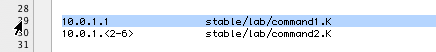

This service uses the selected text in BBEdit or Terminal to open a command file, transcript, an overload file, or an overload directory in BBEdit.  I've tested it with 10.6.8.

For this to work, your radmind server must have AFP enabled and you must have the radmind server mounted.  We created a sharepoint for /var/radmind on the server so we log in ("Finder", "Go" menu, "Connect to Server...") it mounts at /Volumes/radmind.

[Download](../blog/Open%20Radmind%20Item.zip)

If you have a different setup you will need to modify the service with the correct path.  You can do that by opening the service with Automator.  If you don't know how to do this or what to do next you can [contact me](http://www.magnusviri.com/contact.html) and I'll try to walk you through it.

To use the service, unzip it and place "Open Radmind Item.workflow" in ~/Library/Services/.  Open "System Preferences", "Keyboard", then click on "Services" on the left side, then on the right side there will be a long list of services grouped by type.  Look in the "Text" type for "Open Radmind Item".  Enable it and if you want you can assign a keyboard shortcut.  I assigned the keyboard shortcut Shift-Command-R.

You can use the service with BBEdit or Terminal.  The service will launch in all apps but shouldn't do anything if you aren't in BBEdit or Terminal.

In BBEdit, you have to have a file open and some text selected.  You can have the config file, a command file, or a transcript open.  In Terminal, you have to have some text selected that begins with "command/" or "transcript/", or "/var/radmind".

Here are some specific examples.  In BBEdit, I have the config file open.  If I click on the line number on the far left, then it will select the whole line.  When I press Shift-Command-R (my shortcut) the service launches and it will open /Volumes/radmind/command/stable/lab/command1.K.

In a command file, I can select any line (the entire line) that begins with "k", "p", or "n" and it will open that file.

In a transcript file, if I select any line that begins with "f" or "a", it will open the file that is specified, so "/Volumes/radmind/file/name_of_overload.T/path/of/file".

If I have a line with "d" selected, it will open a BBEdit window that starts at that directory.  If I select some random text (nothing that the script will understand, but it has to be something besides a return), then it will open a BBEdit window at the root of the overload, so "/Volumes/radmind/file/name_of_overload.T".

In Terminal, any text that begins with "command/" or "transcript/", or "/var/radmind" will be opened (relative to /Volumes/radmind).  If you select text that looks like this:

/var/radmind/transcript/overload.T:f ./Library/Preferences/bla.plist

or

transcript/overload.T:f ./Library/Preferences/bla.plist

Then it will open /Volumes/radmind/file/overload.T/./Library/Preferences/bla.plist

Note, in BBEdit you can have the whole line selected.  In Terminal it sometimes works and sometimes doesn't (depending on what you have selected).  Just try to have only one item selected.

You can also select command files in Terminal and open them this way.  You can even select multiple command files and it will open them.

I haven't quite figured out a way to remember what it will and wont open.  Yeah I wrote it but forgot all of the rules already.  It works more than it doesn't so I'm happy with it.  If you have Growl installed, it will give you notifications letting you know what it is opening and if it can't find something.

Enjoy.
