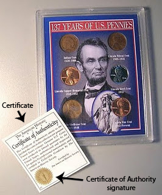

## Quick Setup [Update: 2014-05-24]

Note, if you already understand how Radmind certs work and just want to get it running from scratch, here are the steps.

Run these commands in Terminal

    mkdir -p /var/radmind/CA/private
    cd /var/radmind/CA
    curl -O http://www.rsug.itd.umich.edu/software/radmind/files/openssl.cnf

Edit /var/radmind/CA/openssl.cnf (customize it to your setup)

Pick a passphrase and save it in /var/radmind/CA/private/password

[Download makecert](../blog/20110128_radmind_certs/makecert)

    curl -O www.magnusviri.com/blog/20110128_radmind_certs/makecert

Edit makecert and make sure it is customized to your setup.

Run makecert:

    makecert -c radmind

If everything is correct you will get a dialog asking you to enter the passphrase (the one saved in CA/private/password).  This is the only time you have to enter it.

    makecert -s yourserver.example.com
    makecert identifyByIP

Put certs on clients

## Introduction

[Updated 2013-04-01 with more info on renewing]

I am writing this because I am finally setting this up where I work (I've been putting this off since May 2005...). I first wrote it in January 2011, but I got a lot of stuff wrong.  I rewrote it in March 2012. This is a hard topic to understand so this is mainly my documentation to myself but formatted so that it will be of use to others.

This will take several articles and I'm intending this to be read from beginning to end. I'm not going to try to explain something in a later post that is discussed in an earlier post. If you want to only setup authorization level 1, you can just read the first post. If you want to setup authorization level 2, you need to read the first and second post as the second depends on the first. I am not going to discuss CRL (certificate revocation lists, authorization levels 3 and 4).

I assume you are using OS X. Other *nix's will have almost all of the same steps, but there are a few things I mention that are OS X only.

I also assume you already know how to use [radmind](http://radmind.org/). If you don't, well, good luck understanding this.

What is a certificate authority (CA) and a certificate?
-----------------------------------------------------------

The purpose of certificates is to allow someone to send a message using an untrusted messenger and let the receiver know the message hasn't been tampered with and is not from an impostor.

Here are some real world examples.  Say a person, like a king, wants to send a message to a knight who is far away on the battle field.  The king would give the message to a servant who would get on a horse, ride the horse for a few days, maybe even get on a boat, maybe pass it to other messengers and then finally deliver the message to the knight.  How does the knight know that the message is really from the king and not their enemy?  Or maybe a spy replaced the message while the messenger was sleeping and the new message tells the knight to surrender or that his squire is a traitor.

To solve this, the king would seal the envelope with wax and imprint the cooling wax with a ring.  The message could not be altered without opening the envelope, and the envelope can not be opened with out breaking the wax seal, so if the wax seal is intact, then the knight knows that the message has not been altered.

An easy way to hack this is to just completely remove the seal and put a new one on.  To protect against this, the king uses a unique ring to stamp the wax.  In those days it was fairly difficult to impersonate a ring so this was a fairly safe method of ensuring the authorship of the message.  The knight who received the message would either know what the seal should look like or even better the knight would have a matching ring and could compare the seal by pressing the ring to the wax seal and see if it matches.

A newer example of this same thing is a person who has a bank account.  The account holder can write a check and sign it with their handwritten signature.  Then the person can give the check to another person and that person can take the check to the bank.  If the signature on the check matches the signature that the bank has for the account holder then the bank will exchange money for the check.

Another example is when someone sells something and claims it is special.  Buyers are often impulsive and don't know if a thing is special or not.  But if the buyer knows that someone else has approved of the merchandise and has "certified" it, then the buyer can be confident they aren't buying a counterfeit.

Sometimes sellers know that buyers will blindly trust any "authority" and so they will place an invented certificate on a product package even though the authority is toothless.  The presence of a certificate is meaningless unless the buyer actually knows who the authority is and can verify that the certificate really came from the authority.

In all of these examples, there is an authority, and the authority has a method of certifying that something else is trusted with a signature of some kind.  The CA signing power is a guarded power, sometimes with secrets or difficult to reproduce marks, and in the current age when it is easy to reproduce marks then they must be protected with laws and punishments that discourages forging signatures.

In the wax seal example, the signing power is done with hot wax and a ring that is hard to reproduce that leaves a unique mark in the cooling wax.  In the bank account example, the signing power is the account holder's signature that the account holder developed since learning to write and should be hard to forge.  In the merchandise example, the signing power is an accompanying document from an expert that vouches for the merchandise.

The certificate is not possessed or delivered by the authority but by some third party.  The people who receive a certificate must have some way of verifying the authority and that the authority is actually an authority and not a fake.  And altering or forging a certificate should either be sufficiently difficult or illegal.  If these things are not present then a certificate is meaningless.

In the wax seal example, the message recipient would visually inspect and place their ring in the wax seal to make sure the seal is valid. In the checking account example, the bank would compare the signature on the check with the copy they have on record of the account holder's signature.  In the merchandise example, the buyer would visually inspect the certificate on any product, be able to contact the authority to make sure they really certified the product, and be able to sue the seller if the authority is false or misleading.

Certificates on computers
-----------------------------------------------------------

This same process can be done with computers, but instead of wax, stamps, signatures, seals, etc, the certifying and signing process is done with numbers and math.  But the ideas are exactly the same.  There is some number that represents the CA signing power, a number that represents a certificate, a number that represents a signature, and another number that is able to verify that a signed certificate was actually signed by a particular CA.  And math makes it all work.  Luckily, we don't need to know anything about the math, only the numbers.

- A is a key that locks something.
- B is an opened lock.
- C is a closed lock.  Or to use math: A + B = C
- D unlocks C to get B.  Or to use math: C - D = B

Comparing it with the above wax seal example, A is the wax and ring, B is the message in the envelope, C is the sealed envelope, and D is the ring that is possessed by the message recipient.

If I compare it to a lock, A and D are the keys, and B and C are the states of the lock.  However, the way this is different from a real lock is that A only locks and D only unlocks.  D can not lock and A can not unlock.

Another important concept here is who has which numbers.  By changing who has which number, this system of capable of different things.

For example, if you want anyone to send you secret messages but only you can read them, then you put A on your webpage and you keep D private.  They can create B, a secret message, and use A to create C.  Then can send you C and you use D to get back to B.  B and D are never sent over the internet.  And that is how anyone can send you secret messages.

A different example is if you want to be able to send messages to anyone and you want to prove that you were the one who authored it.  You put D on your webpage but you keep A private.  You write your message, B, you sign it with A to create C.  Then you can give B and C to anyone to pass around (you give out B because you still want people to be able to read it without having to actually verify it).  If someone wants to check if you really wrote B, that person goes to your webpage and gets D and unlocks C to create B.

In all cases, C is out in the wild and it doesn't matter who sees it, and that's the whole point of all of this, you can't control who sees C.

In the secret message examples, B, and D are secret.  A and C are public.  The receiver is the only one who has D.  The sender and receiver have B.

In the public message that can only come from you, B, C, and D are all public.  The author is the only one who has A.

Radmind and certificates
------------------------------

Radmind uses certificates to prove who sends messages.  So A is secret, but all the rest are public.  B is the FQDN of the computer, like `www.example.com`.  A + B = C.  So a computer that claims to be `www.example.com` (by it's IP) gives C to a computer that has D. That computer does the math C - D = B and if the DNS and B don't match then something is wrong!

See, it's possible to forge a FQDN (or something like a man in the middle attack), but it is suppose to be technically impossible to produce a C unless you have A, and A is the super secret guarded key and should never be put on the internet.  That's how a computer proves it is who it says it is.  This is how radmind uses certificates.

Here are the files that represent the numbers described above (and I say "represent" because these things don't seem to be numbers but they are turned into numbers by the magic of the OpenSSL library).

- A is a private key that is /var/radmind/CA/private/CAkey.pem (this path can be anything you want, but the instructions use this path).
- B is a name.  On the server it must be the FQDN of the server (e.g. radmind.example.com).  On the client it is any unique name with no spaces (e.g. firewire_drive_10.6, this name is used to identify a machine in the config file).
- C is /var/radmind/cert/cert.pem.
- D is /var/radmind/cert/ca.pem.

The rest of this article only uses the terminology cert and CA to represent number C and D respectively.  I'll describe how to create all of these files in rest of this article.

Expiring certificates
------------------------------

All of the computer certificate stuff relies on large numbers and math.  Computers keep getting faster, and there is a risk that certificates can be cracked by attempting every possible key to unlock certificates (this is called a brute force attack).  To prevent this, certificates expire.  That means you must renew certificates at least once a year.

So even if you set this up once, you have to keep maintaining it or else it comes to a screeching halt.  Not just a slow stop, but an instant "it worked yesterday but nothing works today and now I have to redo everything" stop.

Yes, I had this happen to me.  Luckily, I was only using certificates on a few machines so it wasn't that big of a deal, but it did point out that I had misunderstood how this all works and I had to recreate everything (and rewrite this article).

And so part of setting this up is setting up a method to renew everything.  I've even considered renewing certs automatically with cron or something, but I haven't decided to go that route yet.  I just created an event in iCal to remind me in 6 months.  Renewing more often than once a year will also keep you more familiar with the process.  And it also means you aren't on a hard deadline and you can put it off if something else is going on.

If your certificates expire, you will see errors like the following.  On the client `repo`, `ktcheck`, `lapply`, and `lcreate` will give this error.

    snet_starttls: error:14090086:SSL routines:SSL3_GET_SERVER_CERTIFICATE:certificate verify failed

On the server you will see an error like the following /var/log/system.log.

    f_starttls: snet_starttls: error:14094415:SSL routines:SSL3_READ_BYTES:sslv3 alert certificate expired

Authorization level 1 and 2
------------------------------

Radmind has multiple authorization levels.  This article is going to discuss 2 levels, aptly named 1 and 2.  To set the authorization level, you add -w followed by the level to all radmind tools that do network communication, e.g. `ktcheck`, `lapply`, `lcreate`, `radmind`.  Therefore I'll call the 2 levels "-w1" and "-w2".

Auth level -w1 does one thing, it has the clients verify the server is really who it says it is.  I originally thought that this should be the server verifying the clients, but it isn't, it's clients verifying the server.

When using the option -w1 (authorization level 1, server verification) the client wants the server to verify it is not an impostor. In this scenario, the CA file goes on the clients (either deployed in an overload or it must be ignored by a negative or exclude file--I'll assume it will be in an overload) and the cert goes on the server.

When using the option -w2 (authorization level 2, server and client verification) you take -w1 and add client verification.  This is why you want to get -w1 setup first.  It's the first step of -w2.  It means that each must possess a CA and a cert. There will be at least 2 certs, one for the client and one for the server. Each cert is signed by the CA possessed by the other. The CA can be the same or different, but it's easier to use the same one and there's no benefit that I can see by having it be different.

Here are the files required for -w1 to work.  A few of them are part of overloads.  The names of overloads can be changed, but the fact that they must be in an overload is required.

Server:

- /var/radmind/file/radmind_client_ca.T/var/radmind/cert/ca.pem
- /var/radmind/cert/cert.pem (if you use more than one server, you may want to use a different name, I'll explain later)

Client:

- /var/radmind/cert/ca.pem (this is put on the client by the radmind_client_ca.T overload)

To make and update certs you need this directory.

- /var/radmind/CA

This directory can be on any computer or any path, but it's easier to keep it on the radmind server at /var/radmind/CA.  This folder isn't required by radmind, it's required to create and update certs.  It's easiest to put it on the radmind server because then you can just `cp` the files around on the same machine.

Certificate Authority on Clients
-----------------------------------

Before you proceed with my instructions, you will need a passphrase. This isn't a password (word != phrase), it is something long and complex. The longer and more complex the passphrase the better your encryption. I would store your passphrase in your Mac's Keychain and a script that you will use to automate client certificate creation (I'll talk about that in a later post).  So don't make it a phrase that you would use elsewhere because it's going to be in a plain text script, but that script should only be root readable, but yeah.

The following instructions are taken from the [radmind wiki](http://webapps.itcs.umich.edu/radmind/index.php/TLS_Cookbook) and I have slightly modified them.

You want to get on the radmind server either by sitting in front of it (or ARD) and opening Terminal.app, or ssh'ing in.  You want to make sure you are root when you do all of this.

    sudo -s

Type your admin account password.  Create directories and needed files. Run these commands in Terminal.

    mkdir -p /var/radmind/CA/certs
    cd /var/radmind/CA
    mkdir crl
    mkdir newcerts
    mkdir private
    echo     01 > serial
    touch index.txt
    curl -O http://www.rsug.itd.umich.edu/software/radmind/files/openssl.cnf

Note: these directories and filenames are not required to be this, but they are hard coded into the example openssl.cnf file downloaded on the last step. To make this as simple as possible, just use these directories and filenames.

Edit the openssl.cnf file and hard code your location and organization information. For example, I changed these lines:

    stateOrProvinceName_default = Utah
    localityName_default = Salt Lake City
    0.organizationName_default = The University of Utah
    organizationalUnitName_default = Student Computing Labs, Mac Group
    commonName = Common Name (eg, the FQDN of the server or the name of the client certificate)
    emailAddress_default = james@example.com

Then run this command. This is the hard scary part for newbies IMO.

    openssl req -new -x509 -days 400 -keyout private/CAkey.pem -out ca.pem -config openssl.cnf

This command is interactive and requires you to enter in the passphrase and the other information like your location and organization.  If you edited openssl.cnf correctly than you can just hit return for the default values for almost all of the questions. Do not forget the passphrase!! For Common Name (CN), use the FQDN of the server. If your server is radmind.example.com, then enter that for the CN.  This will produce 2 files, private/CAkey.pem and ca.pem.

The output looks like this.

    Generating a 1024 bit RSA private key
    ....++++++
    ...........................................++++++
    writing new private key to 'private/CAkey.pem'
    Enter PEM pass phrase:
    Verifying - Enter PEM pass phrase:
    -----
    You are about to be asked to enter information that will be incorporated
    into your certificate request.
    What you are about to enter is what is called a Distinguished Name or a DN.
    There are quite a few fields but you can leave some blank
    For some fields there will be a default value,
    If you enter '.', the field will be left blank.
    -----
    Country Name (2 letter code) [US]:
    State or Province Name (full name) [Utah]:
    Locality Name (eg, city) [Salt Lake City]:
    Organization Name (eg, company) [The University of Utah]:
    Organizational Unit Name (eg, section) [Student Computing Labs, Mac Group]:
    Common Name (eg, the FQDN of the server or the name of the client certificate) []:radmind.example.com
    Email Address [james@example.com]:

To make this so that nobody but root can read these files, run this command.

    chmod -R go-rwx /var/radmind/CA

Put the CA file on the clients
---------------------------------

The ca.pem file goes on the clients at /var/radmind/cert/ca.pem.  To prevent radmind for deleting the file repeatedly, you need to either ignore the path or put the path in an exclude, or you need to create an overload of the file, which is what I suggest because then you can use radmind to distribute the file (best method).

Here is a way to create an overload for the clients. Run these while root user on the radmind server.

    mkdir -p /var/radmind/file/certs/radmind_client_ca.T/private/var/radmind/cert
    cp ca.pem /var/radmind/file/certs/radmind_client_ca.T/private/var/radmind/cert
    cd /var/radmind/file/certs/radmind_client_ca.T
    mkdir -p /var/radmind/transcript/certs/
    fsdiff -c sha1 -1 ./private/var/radmind/cert/ca.pem > /var/radmind/transcript/certs/radmind_client_ca.T
    cd -

Edit /var/radmind/transcript/radmind_client_ca.T to make sure the permissions are correct. It should look like this.

    f ./private/var/radmind/cert/ca.pem                0600     0  0 etc...

Put "p certs/radmind_client_ca.T" in all client command files. That will make sure the file always stays there.

If you need another way to distribute the file use ARD to copy the file to each client.  Or you could put the file on a flash disk and walk around and copy it to each computer (yuck).  Or you could scp the file to each machine (if you have sshd running on the radmind server).  To make scp easier, I actually create symlinks from /certs/ to the overloads.

This command creates the link

    ln -s /var/radmind/file/certs/radmind_client_ca.T/private/var/radmind/cert/ca.pem /certs/ca.pem

Certificate for Each Server
------------------------------

Make sure you are in the CA directory and then run these commands. Enter in the same information that you used when you created the CA. Again, use your radmind server FQDN for the Common Name (like radmind.example.com). When asked, enter the passphrase. It will display the information in the CA and ask if you want to sign the certificate (that is the whole point). If the CA information is correct then type "y". This will also update the index.txt file to record that a certificate has been signed.

Don't copy and paste these commands because they ask for user input and pasting will mess it up.  Just run each command one at a time.

    cd /var/radmind/CA
    openssl req -new -keyout key.pem -out req.pem -days 360 -config openssl.cnf -nodes
    cat req.pem key.pem > new-req.pem
    openssl ca -policy policy_match -out out.pem -config openssl.cnf -infiles new-req.pem
    cat out.pem key.pem > cert.pem
    rm req.pem new-req.pem out.pem

If you only have one radmind server, run the following command.

    cp cert.pem /var/radmind/cert

If you have more than one radmind server, read the next section.

More than one radmind server
-----------------------------------

If you have more than one radmind server, a really easy way to handle the server cert is to give each one a different name and sync them with something like rsync.  Just add /var/radmind/cert to the directories you sync.

    cp cert.pem /var/radmind/cert/radmind_server1.pem

Repeat the commands for creating a cert for each server but be sure to use the correct FQDN for each server for the CN.  remember, you can create certs on any computer so you don't have to be on the particular server when you run these commands. Each server just needs to have the certificate that has it's FQDN for the CN.

Radmind server daemon running with -w1
-------------------------------------------------

If you are already running radmind without certificates then it is probably running on port 6222.  It is a good idea to create a second instance of radmind using certificates on a different port so that each can run at the same time.  And it helps to transition back and forth if you have both setup to run.  If you decide to get rid of the -w0 version, then you can do it and keep the config files around as a backup.

So pick a port to run a new instance of radmind.  The rest of these instructions are going to assume 6223.  If you use a firewall on the server open a hole for the port you specify.

If you have more than one radmind server and are not using the default cert path, you need to specify the custom path with the -y and -z options.  This is what the manpage for radmind says about -y and -z.

>-y cert-pem-file
>Server's public certificate, by default /var/radmind/cert/cert.pem.

>-z private-key-file
>Server's private key, by default /var/radmind/cert/cert.pem.

Test
-----

Now would be a good time to test by just manually running radmind. If you have one radmind server run this command.

    sudo /usr/local/sbin/radmind -p 6223 -w1

If you have multiple servers and are using a custom path to the cert, run this command on the server:

    sudo /usr/local/sbin/radmind -p 6223 -w1 -y /var/radmind/cert/radmind_server1.pem -z /var/radmind/cert/radmind_server1.pem

On a client, make sure you have downloaded the radmind_client_ca.T overload and run this command:

    ktcheck -c sha1 -h radmind1.example.com -p 6223 -w1

If you get an error, stop. Figure it out. Don't go on until you figure out the error and you should get "No updates needed" or a list of updates or whatever. Just not an error.

Be sure to kill the extra radmind processes you started by doing something like:

    ps awwx | grep radmind

Find the process id of the radmind you started (it will have -w1), then kill it.

Debug connection problems
---------------------------------

If you have any trouble follow the next steps.

Make sure it works without the certificates by running `ktcheck` using your default non-certificate port instance.

Server (if you don't already have radmind running, you might want to run ps awwx to find the pid so you can kill it later):

    sudo /usr/local/sbin/radmind -p 6222

Client:

    ktcheck -c sha1 -h radmind1.example.com -p 6222

Then add -w1 and change the port.

Be sure to watch /var/log/system.log on the server since there may be informative messages, like the following.

    Mar 15 17:51:33 radmind-master radmind[36765]: f_starttls: snet_starttls: error:14094418:SSL routines:SSL3_READ_BYTES:tlsv1 alert unknown ca

Again, if you have errors, check these files.

Client

    /var/radmind/cert/ca.pem

Server default cert path (if you only have one server)

    /var/radmind/cert/cert.pem (Or whatever file is specified by -y and -z)

Renewing
------------------------

You need to renew *both* your server cert and the ca once a year.  It is possible to renew the ca without having to redo everything.  The ca file does not show the expiration date.  To find it run this commmand:

    openssl x509 -in ca.pem -noout -enddate

To renew the ca run these commands:

    cd /var/radmind/cert
    cp /var/radmind/file/certs/radmind_client_ca.T/private/var/radmind/cert/ca.pem /var/radmind/cert/ca.pem
    openssl x509 -in /var/radmind/cert/ca.pem -out /var/radmind/cert/ca.pem -days 365 -signkey private/CAkey.pem
    cp /var/radmind/cert/ca.pem /var/radmind/file/certs/radmind_client_ca.T/private/var/radmind/cert/ca.pem
    cd /var/radmind/transcript/certs/
    lcksum -csha1 radmind_client_ca.T

To renew the cert then repeat the above steps for creating the cert in the first place, mainly this one.

    openssl req -new -x509 -days 400 -keyout private/CAkey.pem -out ca.pem -config openssl.cnf

In the next article in this series there is a script that performs these steps automatically.

Automatically run Radmind
-------------------------------

If you got this far and it all works, then set up radmind to always start with -w1.

On OS X launch radmind with a LaunchD plist. This example uses -w1, port 6223, and a custom cert path. Be sure to change it to match what you need.

/Library/LaunchDaemons/com.example.radmind_server_secure_port.plist

    <?xml version="1.0" encoding="UTF-8"?>
    <!DOCTYPE plist PUBLIC "-//Apple//DTD PLIST 1.0//EN" "http://www.apple.com/DTDs/PropertyList-1.0.dtd">
    <plist version="1.0">
    <dict>
        <key>Label</key>
        <string>com.example.radmind_server_secure_port</string>
        <key>ProgramArguments</key>
        <array>
            <string>/usr/local/sbin/radmind</string>
            <string>-f</string>
            <string>-p</string>
            <string>6223</string>
            <string>-u</string>
            <string>007</string>
            <string>-w</string>
            <string>1</string>
            <string>-y</string>
            <string>/var/radmind/cert/radmind_server1.pem</string>
            <string>-z</string>
            <string>/var/radmind/cert/radmind_server1.pem</string>
        </array>
        <key>RunAtLoad</key>
        <true/>
        <key>KeepAlive</key>
        <true/>
    </dict>
    </plist>

Make sure the file is owned by root:wheel and has 644 permissions.

You can start radmind by restarting the server (best way to ensure that you set it up right for real) or by running the following command.

    sudo launchctl load /Library/LaunchDaemons/com.example.radmind_server_secure_port.plist

Run clients with TLS
------------------------

Now, on all the clients, be sure to use -p and -w options with all the client commands, `repo`, `ktcheck`, `lapply`, and `lcreate`. There isn't a lot I can say about this because every institution probably has their own client scripts.

But I thought I would at least share some perl code that I use to select the radmind server. Basically it has 3 lists of servers, one list for each authorization level. Each list contains the hostname or ip of a server and the port that supports that authorization level.

The point of the code is to try to connect (first a syn ping and then a `repo` command) to servers starting with the most secure -w2 and if that doesn't work, then -w1, and if that doesn't work to fall back to -w0. This way, if you setup all of this and if for some reason authorization doesn't work in the future, you can just kill the process on the radmind server that runs authorization and start the daemon without authorization and your clients will fall back to that. Of course, if you don't want to fall back, just leave a particular list empty and it wont try it.

By default the script picks the first server that it can connect to or if you specify -l will load balance based on IP and the number of servers.

    #!/usr/bin/perl

    use Net::Ping;
    use Getopt::Std;

    $debug = 1;

    @RADMIND_SERVERS_W2 = (
        "radmind1.example.com 6224",
        "radmind2.example.com 6224",
    );
    @RADMIND_SERVERS_W1 = (
        "radmind1.example.com 6223",
        "radmind2.example.com 6223",
    );
    @RADMIND_SERVERS_W0 = (
        "radmind1.example.com 6222",
        "radmind2.example.com 6222",
    );

    my $rserver;
    my $rport;
    my $auth_level;

    getopts( "h:p:w:l", \%options );

    my $should_I_run_load_balanced = defined $options{'l'};

    my $error;
    if ( defined $options{'h'} or defined $options{'p'} or defined $options{'w'} ) {
        if ( defined $options{'h'} ) {
            $rserver = $options{'h'};
            print "You are setting port or auth level but not the server. Use -h to manually specify a server or make sure the settings are readable.\n";
            exit 0;
        }
        $rport = $options{'p'} if defined $options{'p'};
        $auth_level = $options{'w'} if defined $options{'w'};
    } else {
        ( $rserver, $rport, $auth_level ) = findBestRadmindServer( $should_I_run_load_balanced, \$error );
    }

    if ( $error ) {
        print "Could not find a server, error is $error.\n";
        exit 1;
    }

    print "-h $rserver -p $rport -w $auth_level\n";

    # now you have a radmind server, the port, and auth level $rserver, $rport, $auth_level

    sub findBestRadmindServer {
        my ( $load_balancing, $error, $errorlog ) = @_;
        # $error is a reference that is assigned to a string if there is an error.

        $load_balancing = 0 if ! defined $load_balancing;

        if ( ! nonempty_var( $RADMIND_AUTH_LEVELS ) ) {
            print "ERROR $0: RADMIND_AUTH_LEVELS is not defined, I'm using 0.\n";
            $RADMIND_AUTH_LEVELS = 0;
        }

        my @new_server_list = ();

        # Start with -w2, then -w1, then -w0
        my $counter = 2;
        foreach my $server_list ( \@RADMIND_SERVERS_W2, \@RADMIND_SERVERS_W1, \@RADMIND_SERVERS_W0 ) {

            if ( $RADMIND_AUTH_LEVELS =~ /$counter/ ) {

                foreach $server_entry ( @$server_list ) {
                    my ( $host, $port ) = split ( ' ', $server_entry );

                    # First ping the port
                    $p = Net::Ping->new("syn");
                    $p->port_number($port);
                    $p->ping($host);
                    if ( ( $host2, $rtt, $ip ) = $p->ack ) {

                        my $pipe = ( defined $errorlog ) ? " 2>> \"$errorlog\"" : "";

                        # Second, run repo
                        print "/usr/local/bin/repo -h $host -p $port -w $counter -e 'Ping' 'Are you there?'$pipe\n" if $debug;
                        my $result = system "/usr/local/bin/repo -h $host -p $port -w $counter -e 'Ping' 'Are you there?'$pipe";
                        if ( $result == 0 ) {
                            push @new_server_list, "$host $port $counter";
                            if ( ! $load_balancing ) {
                                last;
                            }
                        }
                    }
                }
            }

            if ( $#new_server_list >= 0 ) {
                last;
            }
            $counter--;
        }

        if ( $#new_server_list < 0 ) {
            my $message = "No server could be found! (RADMIND_AUTH_LEVELS = $RADMIND_AUTH_LEVELS, RADMIND_SERVERS_W2 = @RADMIND_SERVERS_W2, RADMIND_SERVERS_W1 = @RADMIND_SERVERS_W1, RADMIND_SERVERS_W0 = @RADMIND_SERVERS_W0)";
            if ( defined $error ) {
                $$error = $message;
            } else {
                print "$message\n";
            }
            return;
        } elsif ( $#new_server_list == 0 ) {
            return split ( ' ', $new_server_list[0] );
        } else {
            # Send this computer to one of the servers
            my $my_ip = get_ip();
            my @ip_parts = split ( '\.', $my_ip );
            my $server = $new_server_list[ $ip_parts[3] % ( $#new_server_list + 1 ) ];
            return split ( ' ', $server );
        }
    }

    sub true_var {
        my ( $XHOOKS_VAR ) = @_;
        if ( defined $XHOOKS_VAR and ( lc($XHOOKS_VAR) eq 'true' or $XHOOKS_VAR eq '1' or lc($XHOOKS_VAR) eq 'yes' ) ) {
            return 1;
        } else {
            return 0;
        }
    }

    sub get_ip {
        # This isn't the best way in the world to get the IP
        my $my_ip = `/sbin/ifconfig en0 | egrep "inet .* broadcast" | cut -f2 -d' '`;
        chomp $my_ip;
        return $my_ip if $my_ip ne "";

        $my_ip = `/sbin/ifconfig en1 | egrep "inet .* broadcast" | cut -f2 -d' '`;
        chomp $my_ip;
        return $my_ip if $my_ip ne "";
    }

Next Step
------------------------

You've got -w1 setup.  If that's all you wanted you are all set.  Since there are so few files involved, everything presented in this article should suffice.  However, if you want to use -w2, everything is pretty much the same, except now you are dealing with a lot of files, and it no longer makes sense to run the openssl commands this way.

The next article will discuss how to setup -w2 and then present a script to make it really easy to create certificates.  You can read it [here](http://www.magnusviri.com/radmind-tls-part-2.html).
