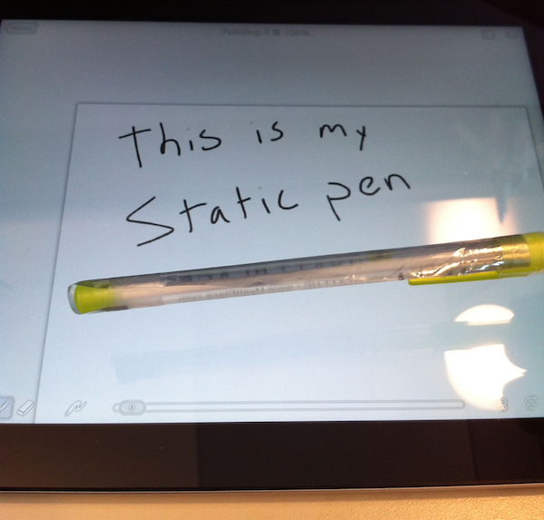
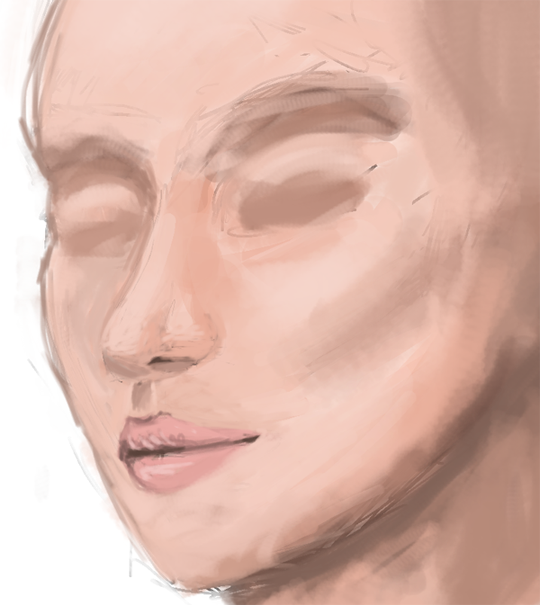

[Update 2020-05-11: I wrote this after I bought one of the first capacitive styluses on the market. There weren't easier to use pens when I wrote this. Now of course these types of pens are everywhere.]

I bought a capacitive stylus but I have to press hard to get it to draw and there is too much resistance.  I've been hesitant to buy a new pen and drawing isn't a major hobby of mine so I'm not that invested in finding the perfect solution.  But I kept thinking I should have something in my house that is capacitive so that I could make my own.  Turns out, I was right.

After searching the web a little bit I found out that anti-static bags were capacitive.  I cut one up and taped a little strip to a pen and I love it.  There is very little resistance and it works better than the stylus I bought.

To get it to work I cut a strip of plastic about 1 centimeter wide and 4-5 inches long, the length of the pen.  I put a few pieces of tape to hold it on the pen.  The plastic needs to be long so that it covers enough of the pen that my hand is always touching the plastic.  The most important part is at the point the plastic needs to be flat against the touch screen.  To get the flatness I actually billowed the plastic at the point so that when I touched the pen down the billowed plastic flattened.

I'm calling it my static pen, which is totally incorrect, but ya know, it's funny.  Here is a photo.

And here is what I drew using it.  Not that great but I'm not really an artist.

I have also been thinking that I could make little versions that simulate chalk, but then I have the problem of touching the screen with my hand with such a little drawing instrument.

Hope this helps someone who wants to experiment making their own stylus.
