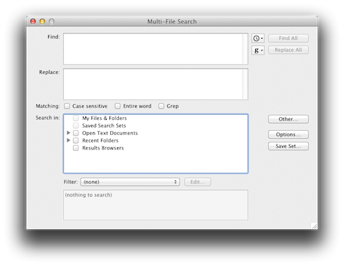

My day job depends completely on searching and replacing text in configuration files.  I've used BBEdit for years.

Unfortunately I needed to do so many (100?) search and replaces that using BBEdit would have taken a long time.

I searched the web and found an article on Lifehacker titled "[How to Quickly Find and Replace Text Across Multiple Files with One Command](http://lifehacker.com/5810026/quickly-find-and-replace-text-across-multiple-documents-via-the-command-line)".

That article almost did what I needed.  I just wanted to add this modification, which allows me to search directories recursively.

    grep "SEARCH" /PATH | xargs perl -pi -e 's#SEARCH#REPLACE#g;';

Another version uses the find command, which allows you to be very specific about which files you search, but it takes longer if you want to search a lot of files.

    find /PATH -name "*.txt" -print -exec perl -pi -e 's/SEARCH/REPLACE/g;' \{\} \;

Example, replacing \r\n with \n

	find html/ -name "*.html" -print -exec perl -pi -e 's/\r\n/\n/g;' \{\} \;

## Renaming Radmind Command Files

I wrote a Perl script that moves a list of files and changes the path in all of the other files as well.  I use this to rename radmind command files.  The script must be run from "/var/radmind/command".

    #!/usr/bin/perl

    my @list = (
        [ "masters/topher_10.7/10.7_staff_fce.K", "masters/topher_10.7/staff_fce.K"],
        [ "masters/topher_10.7/10.7_staff_fcp.K", "masters/topher_10.7/staff_fcp.K"],
        [ "masters/topher_10.7/10.7_staff_laptop_fce.K", "masters/topher_10.7/staff_laptop_fce.K"],
    );

    foreach ( @list ) {
        my ( $search, $replace ) = ( @$_ );
        system "mv", $search, $replace;
        system "grep -lR \"$search\" * | xargs -I % perl -pi -e 's#$search#$replace#g;' %";
    }

## Renaming Radmind Transcript Files

And this perl script renames radmind transcript files.  The script must be run from "/var/radmind".

    #!/usr/bin/perl

    my @list = (
        ["3rd_party_addons/growl_1.2.2_2011.09.09_tn.T", "03_minimum/growl_1.2.2_2011.09.09_tn.T"],
        ["3rd_party_addons/growl_1.3.3_2012.06.08_mse.T", "03_minimum/growl_1.3.3_2012.06.08_mse.T"],
        ["3rd_party_addons/growl_1.3.3_2012.06.08_mse.T~", "03_minimum/growl_1.3.3_2012.06.08_mse.T~"],
    );

    foreach ( @list ) {
        my ( $search, $replace ) = ( @$_ );
        system "mv", "transcript/$search", "transcript/$replace";
        system "mv", "file/$search", "file/$replace" if -e "file/$search";
        system "grep -lR \"$search\" command | xargs -I % perl -pi -e 's#$search#$replace#g;' %";
    }
