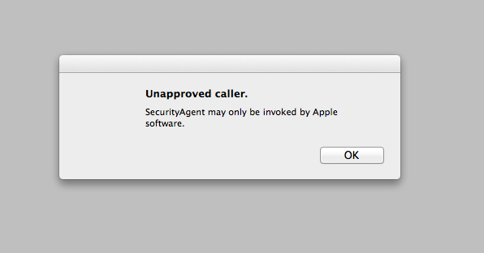

[Update 2021-10-20: [/var/folders strike again!](https://mrmacintosh.com/macos-upgrade-to-big-sur-failed-stuck-progress-bar-fix-prevention/)]

#### What is "/var/folders"?

I can't find any documentation about "/var/folders" online, none at all.  All I can find is a lot of forum and discusion boards that talk about it.  So I decided to clobber what I knew and what I could find into this page.  Everything discussed is Mac OS X 10.9 unless otherwise noted.

"/var/folders" (or "/private/var/folders") is ["per-user temporary files and caches"](https://developer.apple.com/library/mac/documentation/Darwin/Reference/ManPages/man7/hier.7.html).  It is created and managed by Mac OS X.  It first showed up in 10.5.  It's purpose is to increase security by improving permissions (rwxr-xr-x) over previous temp and cache locations (/Library/Caches and /tmp, which are both rwxrwxrwt).  There is a user cache in ~/Library/Caches and the only advantage I can see for "/var/folders" is to have a cache that is not in the home folder, for example, to avoid transfering data over a network when using network homes.  That's just a guess.  There is also [mention](http://arstechnica.com/civis/viewtopic.php?t=42677) that the folder naming "randomization" inside of "/var/folders" adds security.

The man page for `confstr` also says the following.

>_CS_DARWIN_USER_TEMP_DIR
>
>Provides the path to a user's temporary items directory. The directory will be created it if does not already exist. This directory is created with access permissions of 0700 and restricted by the umask(2) of the calling process and is a good location for temporary files.
>
> By default, files in this location may be cleaned (removed) by the system if they are not accessed in 3 days.
>
>_CS_DARWIN_USER_CACHE_DIR
>
>Provides the path to the user's cache directory. The directory will be created if it does not already exist. This directory is created with access permissions of 0700 and restricted by the umask(2) of the calling process and is a good location for user cache data as it will not be automatically cleaned by the system.
>
> Files in this location will be removed during safe boot.

You can get the user cache and temp directories with the getconf command.  This is what I get on Mac OS X 10.9.

    getconf DARWIN_USER_CACHE_DIR
    /var/folders/zz/zyxvpxvq6csvxfm_n000jt7w004fjz/C/

    getconf DARWIN_USER_TEMP_DIR
    /var/folders/zz/zyxvpxvq6csvxfm_n000jt7w004fjz/T/

The temp dir can also be found by echoing the TMPDIR variable.

    echo $TMPDIR
    /var/folders/zz/zyxvpxvq6csvxfm_n000jt7w004fjz/T/

#### Complaints

The biggest 2 complaints that I found online about "/var/folders" is that it is either huge, or there is personal information in there, which was a bigger deal with [FileVault](https://en.wikipedia.org/wiki/FileVault) 1 (10.3 to 10.6), when only the home folder was encrypted.  10.7 introduced FileVault 2, which encrypted the entire disk.

I've read that "/var/folders" is deleted at startup, but that is not true.  The confstr man page said the cache will only be deleted with a safe boot and only files older then 3 days are cleaned out of temp.  Either way, you can delete "/var/folders" and reboot whenever you would like without danger of ruining anything.

We also had a problem that I tracked down to this folder.  I'll describe that later.

#### Open files

Want to see just how many file handles are open inside of "/var/folders"?  Note: file handles are not the same as files, 2 file handles can point to the same file.

    lsof | grep /var/folders

I had 1751 files open file handles inside of "/var/folders".  1715 were in my user folder "/var/folders/zz/zyxvpxvq6csvxfm_n000jt7w004fjz".  Out of those 747 were in the "C"ache folder, 968 were in the "T"emp folder.  1437 file handles were for one thing.

* com.apple.IconServices

1437 IconServices file handles, 507 cache file handles and 930 temp file handles.  The processes that had them open were Mail, BBEdit, Dock, SystemUIServer (1115 of them!), Finder, QuickTime, Safari, Xcode, Remote Desktop, NotificationCenter, something Microsoft, and something Apple.  This IconServices thing is new in 10.9 and [has caused some issues](http://kieranhealy.org/blog/archives/2014/01/07/an-issue-in-mavericks-with-com-dot-apple-dot-iconservicesagent/) (as all 1.0 features seem to).  This almost prompts me to start researching IconServices, but I'm already getting behind by researching "/var/folders" and I'm just going to take a wild guess that IconServices is Apple's attempt to cache all of the icons used by the GUI.  Expect this all to change in the next major OS.

Besides the IconServices stuff, there were 278 other file handles.  3 files were open more then any other (174 file handles).

* 91 handles for C/com.apple.LaunchServices-044145983.csstore.
* 51 handles for C/com.apple.IntlDataCache.le.kbdx
* 32 handles for C/mds/mdsDirectory.db

The root folder is "/var/folders/zz/zyxvpxvq6csvxfm_n0000000000000".  The only file open in there was C/com.apple.LaunchServices-0440.csstore and it was open by processes that were running as root and non-root, which is odd because the permissions on the folder only allow the root user.  The other users with directories in "/var/folders" were _appleevents, _coreaudiod, _securityagent, _locationd, _mdnsresponder, _softwareupdate and _windowserver.

The last thing I'll mention is that there were many folders in "/var/folders" but the only ones that were open were in the zz directory.  Also, within zz in each folder there were several folders besides "C" and "T", such as "0" and "Cleanup At Startup" but the only open files were in "C" and "T"

To get an idea of why "/var/folders" matters, I also ran lsof and looked for the other cache and tmp locations that I know about.  There were 914 file handles open in ~/Library/Caches, 863 were Safari.  4 file handles for /Library/Caches, and 18 file handles for /System/Library/Caches.  There is a file named com.apple.IntlDataCache.le.kbdx in /System/Library/Caches (there's one in "/var/folders" for the user).  There were 50 file handles for /tmp and /var/tmp.

#### Default structure

I just upgraded about 200 Macs to 10.9 and periodically right after they run radmind they freeze at startup with a dialog saying "Unapproved Caller", "SecurityAgent may only be invoked by Apple Software".

I eventually figured out that if I deleted everything in "/var/folders" and rebooted it would be fine.  But after making some inquiries it appears that if "/var/folders" doesn't have the correct structure it could cause the error.

These are the folders that showed up on the 200 Macs I've got.  There were other folders but they weren't common across them all.  The format of the following lines are file type, path, mode, owner, group.  These paths weren't random.  The paths of other folders for our users did appear somewhat random.

    d ./var/folders                            0755     0     0
    d ./var/folders/04                         0755     0     0
    d ./var/folders/zz                         0755     0     0
    d ./var/folders/zz/zyxvpxvq6csfxvn_n0000000000000    0755     0     0
    d ./var/folders/zz/zyxvpxvq6csfxvn_n000003000000r    0755    24    24
    d ./var/folders/zz/zyxvpxvq6csfxvn_n000003800000t    0755    26    26
    d ./var/folders/zz/zyxvpxvq6csfxvn_n000006w00001q    0755    55    55
    d ./var/folders/zz/zyxvpxvq6csfxvn_n0000084000021    0755    65    65
    d ./var/folders/zz/zyxvpxvq6csfxvn_n00000b000002r    0755    88    88
    d ./var/folders/zz/zyxvpxvq6csfxvn_n00000b400002s    0755    89    89
    d ./var/folders/zz/zyxvpxvq6csfxvn_n00000bh00002w    0755    92    92
    d ./var/folders/zz/zyxvpxvq6csfxvn_n00000c4000031    0755    97    97
    d ./var/folders/zz/zyxvpxvq6csfxvn_n00000s0000068    0755   200   200
    d ./var/folders/zz/zyxvpxvq6csfxvn_n00000s800006_    0755   202   202
    d ./var/folders/zz/zyxvpxvq6csfxvn_n00000sm00006d    0755   205   205
    d ./var/folders/zz/zyxvpxvq6csfxvn_n00000th00006m    0755   212   212
    d ./var/folders/zz/zyxvpxvq6csfxvn_n00000tm00006n    0755   213   213
    d ./var/folders/zz/zyxvpxvq6csfxvn_n00000vr00006y    0755   222   222
    d ./var/folders/zz/zyxvpxvq6csfxvn_ngzzzzzvzzzzzy    0755    -2    -2

#### Searching the filesystem

I wasn't happy with the lack of information so I grepped a vanilla 10.9.1 OS image and found "/var/folders" in several places.

* A lot of sandbox profiles: /System/Library/Sandbox/Profiles/*.sb and /usr/share/sandbox/*.sb (usually looks like `regex #"^/private/var/folders/[^/]+/[^/]+/C/mds/mdsDirectory.db$`)
* Application binaries (e.g. App Store.app, Messages.app, iBooks.app, and a bunch in /S*/*/CoreServices)
* Framework binaries (e.g. /System/Library/Frameworks and /System/Library/PrivateFrameworks such as AppKit, Metadata, OSInstall, etc.,.)
* /var/db/dyld/dyld_shared_cache_*
* /bin/launchctl and /usr/libexec/dirhelper
* /usr/lib/system/libsystem_c.dylib and /usr/lib/system/libsystem_malloc.dylib
* /System/Library/CoreServices/backupd.bundle/Contents/Resources/StdExclusions.plist
* /System/Library/PrivateFrameworks/SystemMigration.framework/Versions/A/Resources/FallbackSystemFiles.plist
* /usr/bin/sandbox-simplify
* /usr/libexec/locate.updatedb

#### Searching the source code

I decided to download the [Darwin source code](http://opensource.apple.com) and look for stuff.  Here is a discussion of the source code files that reference "/var/folders" and related stuff.

###### [launchd-842.1.4/support/launchctl.c](http://opensource.apple.com/source/launchd/launchd-842.1.4/support/launchctl.c)

The line in launchd-842.1.4/support/launchctl.c will create "/var/folders" at startup if the file is missing.

###### [system_cmds-597.1.1/dirhelper.tproj/dirhelper.c](http://opensource.apple.com/source/system_cmds/system_cmds-597.1.1/dirhelper.tproj/dirhelper.c)

This is the /usr/libexec/[dirhelper](https://developer.apple.com/library/mac/documentation/Darwin/Reference/ManPages/man8/dirhelper.8.html) command.  It is responsible for cleaning out old files in "/var/folders".  The function that does that is clean_files_older_than().  It loads an environment variable named CLEAN_FILES_OLDER_THAN_DAYS.  That variable is set by the launchd plist file at /System/Library/LaunchDaemons/com.apple.bsd.dirhelper.plist and it is set to be 3 days.  The launchd plist file runs dirhelper at 3:35 AM.

###### [Libc-997.1.1/darwin/dirhelper_priv.h](http://opensource.apple.com/source/Libc/Libc-997.1.1/darwin/dirhelper_priv.h)

Contains the following line.

    #define VAR_FOLDERS_PATH        "/var/folders/"

###### [Libc-997.1.1/darwin/_dirhelper.c](http://opensource.apple.com/source/Libc/Libc-997.1.1/darwin/_dirhelper.c)

I believe this file sets "/var/folders" for several API's, including confstr(), which I look at next.

###### [Libc-997.1.1/gen/confstr.c](http://opensource.apple.com/source/Libc/Libc-997.1.1/gen/confstr.c)

It appears that confstr() is the C API that everything else uses to get the tmp dir.  I would bet that [NSTemporaryDirectory](https://developer.apple.com/library/mac/documentation/Cocoa/Reference/Foundation/Miscellaneous/Foundation_Functions/Reference/reference.html#//apple_ref/c/func/NSTemporaryDirectory) uses confstr.  NSTemporaryDirectory() returned the path "/var/folders/zz/zyxvpxvq6csvxfm_n000jt7w004fjz/T/".  Here is [a good discussion of temporary files in Cocoa](http://www.cocoawithlove.com/2009/07/temporary-files-and-folders-in-cocoa.html).

###### [launchd-842.1.4/src/core.c](http://opensource.apple.com/source/launchd/launchd-842.1.4/src/core.c)

The function job_postfork_become_user() calls confstr and gets the temp dir.  I'm guessing job_postfork_become_user() is called every time a user logs in.  So that's how "/var/folders" is getting set as the temp dir.

I guess the reason I did this is because if I want to figure out the weird folder naming in "/var/folders" I should inspect the dirhelper source code, probably the following code.

    res = snprintf(path, pathlen,
        "%s%.*s/%s/%s",
        VAR_FOLDERS_PATH, BUCKETLEN, str, str + BUCKETLEN, subdirs[which]);

I'm still not sure this explains it all though because these are for the cache and temp directories and there are still other directories in there that are unexplained.  However, when I grepped the entire file system "/var/folders" appeared in a lot of frameworks and I don't have the source code to any of that.  I'm happy with what I've found, it explains enough.

#### Why care about "/var/folders"?

Why did I go digging for information on "/var/folders"?  The biggest reason is the "Unapproved caller" error I talked about above.  The other reason I did all of this research is because we have some difficulty with cache files on our computers.  First, we have a lot of unique users (we're a university) and "/var/folders" was getting huge.  We deal with home folders so that it doesn't fill our hard drives, but "/var/folders" got out of hand.  So I started just plain emptying it without really knowing the ramifications.  Now I know what they are.

Another reason is because I'm aware that Mac OS X uses caches very aggressively to make it faster and because we delete the caches this makes our computers much slower then a Mac owned by a single person, especially when logging in.  So I wanted to do all of this research to see if I could figure something out about it.  I'm not really closer to a solution to this, but at least I have some ideas.

#### Please say something

Here is where you get to help.  If you know something about "/var/folders" that I haven't said please leave a comment.  Thanks!
