Basics of computer networking. Enough detail and terminology to perhaps help someone do some basic home or small office network setup.

Part 1 - History
--------------------

#### Early History

 
Painting by Frederic Remington; <a href="https://commons.wikimedia.org/wiki/File:Frederic_Remington_smoke_signal.jpg">Amon Carter Museum, Fort Worth</a>

I want to begin with a little history, not everything, just a few landmarks that are fundamental in computer networking.  Two long distance communication techniques that have been around for millennia are letters and audible or visible broadcast messages like drum or smoke signals.  The electric telegraph began to be used commercially in the 1820's and a gradual but accelerating change has taken place ever since.

The electric telegraph worked by placing wires between two locations with a device on one end that did something when electricity was applied on the other end.  You can imagine it as a water pipe and if you turn the tap on at one end and water travels down the pipe and comes out at the other end.  By turning the tap on and off in some pattern you could send messages.

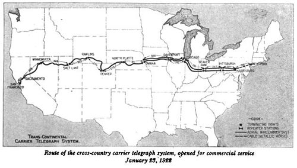 
Source: <a href="http://earlyradiohistory.us/1922cc.htm">earlyradiohistory.us</a>

Electricity traveling over a wire is called a circuit.  The reason it is called a circuit is that electricity always travels in a loop and has to end up where it started.  That's why batteries always have 2 ends, one end is where it leaves, the other end is where it comes back.

For years telegraph lines were being strung from city to city but they were directly connected to a single building within those cities. A major advance in this wire communication medium began when they started to share the transmission wires. This worked much like railroad switches that allow trains to take different paths.  Early telephones were switched by a switchboard operator.  Telephone numbers were coordinates on the switchboard and when a wire was connected from the caller to the person being called it created a circuit.  Eventually operators were replaced with machines that created the circuits based off of the pulses and tones that they heard when telephone users dialed a number.  But it still functioned by creating a circuit between two end points and it is called a circuit switching network.

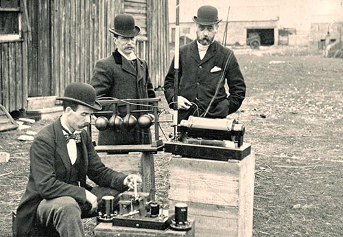 
British Post Office engineers inspect Guglielmo Marconi's wireless telegraphy May 13th, 1897; <a href="https://en.wikipedia.org/wiki/File:Post_Office_Engineers.jpg">Cardiff Council Flat Holm Project</a>

Another major communication advance was radio.  Radio is unlike wired communication.  Wired communication is fairly private (unless someone taps into the wire).  Radio communication is broadcast to anyone within reach of the signal.  So in a way, radio is an advancement over drum and smoke signals and wires are an advancement over letters.

#### Computer Networking History

In the early days of computer networking each company made their own version of networking and few of them worked with computers from other companies.  Some organizations attempted to make standards so that computers from different companies could talk to each other.  The Department of Defense Advanced Research Projects Agency (DoD ARPA, later renamed DARPA) and universities wanted to solve the problem of computers not talking to each other and they basically created what we now know as the internet.  In 1969 the ARPANET was created and included 4 nodes, University of California, Los Angeles, University of California, Santa Barbara, Stanford Research Institute, and the University of Utah (that's right, where I work).

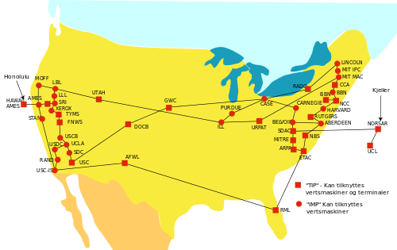 
<a href="http://commons.wikimedia.org/wiki/File:Arpanet_1974.svg">ARPANET 1974</a>

The main feature of ARPANET was that it was a packet switching network.  This is different then a circuit switching network (the telegraph and telephone lines).  To remind you, a circuit is when 2 end points make a loop with each other just like a phone call.  A packet is an electronic version of a letter and it is transferred across the network electronically.  A packet is dropped into an electric mailbox with a "to" address and it could take several different routes to get to its destination. This is different from a circuit where the two ends have to actually form a complete loop.

A side note about ARPANET is that it was not created to survive a nuclear war as many say.  The purpose to give researchers access to powerful computers located far away.

The ARPANET was eventually replaced with an improved version that used a standard called the Internet Protocol Suite, commonly called TCP/IP.  This new network became the Internet (with a capital "I").

#### The Internet

I'm going to discuss four parts of the Internet.  I'll compare it to a spider web.  There are the silk strands of web between connections.  There are the connections, where the strands connect to each other. There are the parts where the strands connect to the outside world that holds the web up. And there is a spider that travels on the web.

The connections are called nodes, communication devices that relay information, called hubs, bridges, switches, and routers. The strands that connect to the outside world are called nodes as well, but more specifically they are called hosts, and they are the computers that people use. The strands between nodes are wires, fiber optics, and radio waves. The spider traveling on the web is the data.

 
<a href="http://en.m.wikipedia.org/wiki/File:Russian-Matroshka2.jpg">Russian nesting dolls</a>

Data on the Internet is layered like an onion, or like Russian nesting dolls, or like envelopes inside of envelopes.  This is called encapsulation.  The outer layers have addresses on them that direct it to its destination.  As it travels across the network the outer layers are sometimes removed and replaced with different layers with different addresses helping the data reach its destination.  At the very center is the heart, the message that is intended only for the destination computer.

The TCP/IP networking model defines and explains how the parts that I just discussed fit together, and more importantly, the model makes it possible for the different technologies and mediums to work together.  It accomplished this by breaking up portions of the networking tasks into the layers, what I referred to earlier as Russian nesting dolls.

There are four TCP/IP layers and each has a different name and different properties.  As I discuss how the data travels across the network I'll talk about each layer in turn.

I should mention here that there is a very similar networking model called the Open Systems Interconnection (OSI) but it is a concept and is not what the internet is built on.  Instead of 4 layers like TCP/IP, it discusses 7 layers.  I'll spend a lot of time talking about the first OSI layer, the Physical layer.  It is not part of the TCP/IP model but it is important to discuss.

Part 2 - The Physical Layer
--------------------

The OSI model calls the first layer the Physical layer.  This layer defines how signals transmit information. I'm going to discuss what a signal is and how that signal is handled when it's transmitted over the wired and wireless mediums.

#### Signal - Digital vs Analog

A signal can be either electricity in a wire, light in a fiber optic cable, or radio waves traveling between antennas.  A signal is basically a measurement of something, like how much electricity is in the wire, how fast it is changing direction, the color of the light, etc.,. A signal will have a minimum and maximum value.

A signal can be analog or digital.  The difference between the two is simple.  A digital value has a limit on the possible values.  An analog signal has no theoretical limits. You could say a digital value is only whole numbers between 2 values, like 0 and 100.  An analog signal can be all floating point numbers between 0 and 100. The only limit on analog is how precisely the electronics can read the value.

So a good question is how many different choices do you need to send on the wire at a given moment? If the data you want to transfer is a book then you need values for every letter and punctuation, 26 upper case letters, 26 lower case letters, 0-9, space, period, apostrophe, etc.,. So 26+26+10+1+... Let's just make it a number bigger then we actually need and say we need 100 different choices. A value of 1 is "A", 2 is "B", 27 is "a", etc.,. If we want to transfer those values over a wire we don't actually need floating point numbers so we'll say if a value looks like 2.3 it's really 2 (a "B").

Well, background noise can change the values on a wire. So what happens if there is a lot of background interference and it changes our values so badly that sometimes a 2 appears as 2.8? It would be rounded up to 3, not what we want. What we could do is send 2 values between 0 and 50 and add them up to get our desired value. So a 0 and a 2 would be "B". What if the interference was worse and we could only send 10 different values at a moment? We'd send 10 values and add them up.

It just so happens that in some situations, we can only send 2 values, 0 or 1. Instead of sending 100 0's and 1's and adding them up, it's possible to use binary, a much more effective way to send data. In binary, a "bit" is a single value, 0 or 1 and eight bits is called a "byte" and it can represent 0 to 255.

And in fact there is a standard for representing text with 255 values called ASCII. It is old and isn't the best choice sending text but it is still in use. The preferred standard is called Unicode, or UTF and it can represent 110,000 letters and characters from about every language you didn't know existed, including Chinese, Japanese, Arabic, Hebrew, Cyrillic, Sanskrit, etc.,.

#### Signal Interference

The problem with signals is that the signals change as they move across the cables and through the air.  If a signal degrades too much the data passing over the network will get corrupted.  The effect of this is that if a user is downloading a file it will seem to download slowly.  However, data in copper wires travels about 2/3 the speed of light and it travels at the speed of light in fiber optics and as radio waves so it's not slow at all.  What is actually happening is that the data keeps trying to come but nothing gets through cleanly.  It's basically like talking on a phone and everybody can hear each other but it is too garbled to understand what anyone is saying.  It would break down into a lot of "I don't understand you" messages.

To understand how this corruption occurs, you need to understand a few properties of electricity.  If electricity travels through unshielded wires and changes direction back and forth quickly the electricity will actually convert into radio waves and bleed off and travel through the air.  When those radio waves hit another unshielded wire the waves will convert into electricity and enter the wire.  Unless a wire is suppose to be an antenna, radio waves will change any signal traveling through the wire.  This is called electromagnetic interference (EMI), radio-frequency interference (RFI), or just background noise.

Radio waves are constantly around us everywhere.  Radio waves come from television and FM/AM radio stations, mobile phones, Wi-Fi routers, any electrical equipment that has wires inside that are not shielded, overhead power lines, the Northern Lights, the sun, and even from outside of our solar system.  Radio waves also reflect off of metal objects and can create slightly delayed ghost signals, which might be a problem if a large metal box is next to an antenna (unless it's suppose to be there).  Older electronic devices tend to give off a lot of interference, especially with motors like an old sewing machine (newer electronics give off less interference). And finally, there are devices that operate at the same frequency as Wi-Fi routers, specifically microwaves, hospital equipment, cordless phones, remote controlled vehicles, etc.,.

There are several factors that determine how much a wire is susceptible to interference.  Length is a huge factor.  As electricity travels through cables it slowly bleeds out as radio waves.  After a certain length there isn't enough electricity in the wire for the signal to be distinguished from the background noise.  I'll mention the longest length of wire when I discuss certain types of wires.

Another problem is called crosstalk and this happens when 2 copper cables are near each other and one acts as a transmitter and the other acts as a receiver and the signal is changed.  Any 2 wires that are next to each other will crosstalk unless it's engineered not to.  Kinks or stretching can damage cables and that can introduce signal interference.

There are several methods to minimize signal interference.  Shielding a cable will reduce the interference, but the shielding adds to the cost of the cable. If the wires are an exact distance from each other (called balanced pair) or if they are twisted around each other (called twisted pair) that will minimize interference. The devices that connect the cables and listen to wireless signals have ways of checking for corrupt signals and can even correct some errors.  For example, Wi-Fi has to use a lot of error correction because it's hard to get a perfect signal every time.

#### Copper Cables - Ethernet

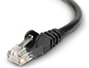

The most common type of network cable that people will encounter is called an ethernet cable.  It is the least expensive networking cable.  Almost all computers have ethernet ports.  Ethernet and Wi-Fi are the most common ways to connect computers to the internet.

Ethernet cables are made of copper wires that are twisted around each other like DNA strands.  This is called twisted pair. There are usually 4 pairs of wires (8 wires total) and on the ends the cables have rectangular plugs that has a tab that locks it in the port (called an RJ45 connector).

There are several types of ethernet cables, but CAT-5e remains the most popular.  The cable will usually have CAT-5e marked on the cable somewhere.

CAT-5e cables have speeds of 10BASE-T, 100BASE-TX (Fast Ethernet), and 1000BASE-T (Gigabit Ethernet).  The number refers to megabits per second, so 10, 100, 1000 megabits, or 10 gigabits per second.  "BASE" means baseband transmission, which describes how the signal is sent over the wire (Wi-Fi, DSL, and cable internet use passband, just a different way to send the signal).  "T" means twisted pair cables.

The maximum length is 100 meters (328 feet. Ethernet is not used to connect homes to service providers because of the limited distance.

A special type of ethernet cable is called a crossover cables. These cables are usually only a few feet long and are used to connect devices of the same type (e.g. computer to computer).  Regular non-crossover cables are always used to connect devices that are different (e.g. computer to switch). Many devices auto detect what they are connected to and don't require crossover cables.

#### Copper Cables - Coaxial

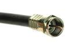

Coaxial cables are round and stiff.  They have a wire in their center covered by plastic layer with a metal foil around that.  They usually have connectors that screw on (some cheaper cables slide on).  They are commonly used in homes to connect television sets to antennas or cable TV (they are called CATV cables in that case).  They are also used with cable internet modems.

RG6 coaxial cables (RG means radio grade) are the most common coaxial cable for home use.  Don't use the lower grade RG59.  RG11 is a higher grade cable that can run longer distances and is used to connect homes to the cable company.  RG11 is more expensive and might need to be ordered online.  RG11 is sized slightly different then RG6 so you'd need adapters to use RG11 with RG6.  Generally, unless you need very long coaxial cable, stick with RG6.

RG6 is a generic category of cables and the cables vary greatly.  Cables with more shielding or that use copper shielding instead of aluminum will have less signal loss.  I've read that triple shielding is better then quad shielding but I really don't if that's accurate at all. There are also types that can be buried or types that are intended to be hung on telephone poles.

The maximum length of RG6 depends on the shielding and type of metal core (copper is better). Bends and kinks in a coaxial cable will destroy it.  Adding adapters or splitters to split a signal to multiple TV's will decrease the signal strength as well.

I couldn't find any definitive answers on the maximum length of coaxial cable online. In fact I saw some figures that don't even make sense. What I know is it's better then ethernet, and not as good as fiber optics. Ethernet is 100 meters (328 feet) and fiber optics is 600 meters to 1 kilometer (there doesn't seem to be agreement on this either). I did see one authoritative looking document that said the maximum length of coaxial is 500 meters.

#### Demarcation Point

Homes generally are at the mercy of the internet service providers they live near. There will usually be a box, called a demarcation point (DEMARC) or Main Point Of Entry (MPOE). Everything from the DEMARC and in the house is owned by the home owner. The DEMARC and everything past that is property of the service provider.

There are 2 common ways to hook up to the internet. Cable providers run an RG6 or RG11 cable to the house DEMARC. Digital Subscriber Line (DSL) uses the plain old telephone service (POTS) DEMARCS.

As a side note about telephone cables, the old telephone cables are twisted pair, similar to ethernet cables but have fewer wires.  I haven't used the twisted pair that comes to my house in at least a decade.  I've been using the voice over IP (VoIP) service from my cable provider and I finally canceled that when everyone in my house got a mobile phone.

#### Wireless - Wi-Fi

Wireless is fundamentally different from wired connections.  Several factors affect wireless that don't affect wired connections.  All of these factors make wireless much slower then wires.

- Wireless devices can't listen and transmit at the same time.
- Wireless devices use a small part of the frequency spectrum (ethernet cables can use the entire spectrum--this is the difference between passband and baseband).
- When a wireless device listens it will hear all wireless devices in range that are transmitting at the same frequency (it can easily ignore other frequencies).  To avoid interference wireless devices tell each other to be quiet when they are going to talk so they have to take turns.
- Distance and obstacles make wireless signals weak and it's hard to hear them over the background noise. Reflections also cause interference.

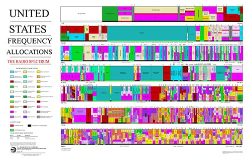 
<a href="http://en.m.wikipedia.org/wiki/File:United_States_Frequency_Allocations_Chart_2011_-_The_Radio_Spectrum.pdf">United States Frequency Allocations Chart 2011</a>

The radio frequency spectrum is regulated by the government.  Most frequencies require a license to use.  Some frequencies were set aside for industrial, scientific and medical (ISM) uses with devices like welders, microwaves, and hospital equipment and they didn't require licenses to use those devices.  Eventually many other devices started using these same frequencies like cordless phones, remote control toys, and Wi-Fi.

There are a few verions of wireless routers.  802.11a and 802.11b were both released at the same time 1999 but were incompatible with each other.  802.11a was more expensive and had better speeds.  802.11b became more popular because of its low price. Since then each new version of 802.12 has increased bandwidth, data rate, and range over the previous versions.   Newer versions are 802.11g (2003), 802.11n (2009), and 802.11ac (2014).  Here are a few stats.

- 802.11a - 54 Megabits per second, 115 feet indoor/ 390 feet outdoor
- 802.11b - 11 Megabits per second, 115 feet indoor/ 460 feet outdoor
- 802.11g - 54 Megabits per second, 125 feet indoor/ 390 feet outdoor (looks the same as 802.11a but g is compatible with b)
- 802.11n - 72/150 Megabits per second, 250 feet indoor/ 820 feet outdoor
- 802.11ac - up to 866.7 Megabits per second, couldn't find ranges, it's too new.

Part 3 - Devices
--------------------

Now you know about the physical layer and some of the issues with the wired and wireless mediums. Now I'm going to talk about the devices that sit in closets and connect the wired and wireless mediums.

#### Network Communication Devices - Introduction, Modems, and Hubs

All of the wires, fiber optics, and radio antennas connect to network communication devices.  These devices range from basic repeaters to full blown computers that are able to process data extremely quickly.  All of these devices have ports, connectors, or antennas to connect all of the wires and stuff that I've been talking about in the previous sections, the Physical layer.

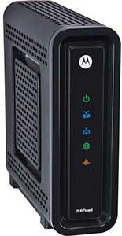 
ARRIS Motorola SB6121 SURFboard, <a href="http://www.amazon.com/ARRIS-Motorola-SB6121-SURFboard-DOCSIS/dp/B004XC6GJ0/ref=sr_1_1?ie=UTF8&qid=1395333243&sr=8-1">about $70 on Amazon</a>

A modem (MOdulator-DEModulator) connects 2 different physical mediums.  2 very common modems are DSL modems and cable modems.  Modems convert the signal that a computer understands to a signal can be sent on a DSL or cable lines.  The modem would plug into a coaxial or telephone cable and those would plut into the demarcation point.  Mobile phones also have modems in them that converts the signal between the cell phone network and the phone.  There are other modems as well.  These are Physical layer devices.

Another physical layer device is called a hub.  It simply repeats everything it hears.  Hubs used to be common but because of the dropping costs of the more complex devices I don't even know if you can buy them anymore.  Hubs repeat what it hears on one port to all of the other ports.  Hubs are classified as Physical layer devices because all they are concerned with is the signal, they don't actually look at the content.  A hub can cause what is called a collision, where 2 nodes try to send data at the same time and both signals are lost.

#### Network Communication Devices - Bridges and Switches

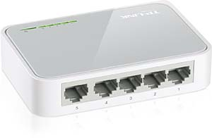 
TP-LINK TL-SF1005D 5-port 10/100Mbps Desktop Switch, <a href="http://www.amazon.com/TP-LINK-TL-SF1005D-5-port-100Mbps-Desktop/dp/B000FNFSPY/ref=sr_1_1?ie=UTF8&qid=1395333031&sr=8-1">$10 on Amazon</a>

Bridges and switches are Link layer devices. Link layer devices transmit and receive data on the physical layer.  In this layer, the data is called frames.  As the data moves up the layer stack the name of the data will change.  This way if someone said "bit" you'd know they meant the physical signal.  If someone said "frame", you know they mean the Link layer.  The data has layers like the Russian nesting dolls. The outer most layer is used by the Link layer.

Data needs to have some way of finding their way around the network and that is accomplished by putting addresses on the data.  Desktop computers, laptops, smart phones, some game consoles, network bridges, switches, and routers all have a network address that is set when the devices are manufactured.  This address is called the hardware or Media Access Control (MAC) address.

To connect a desktop computer to the network you plug an ethernet cable into the back of the computer.  The other end of the ethernet cable usually plugs into a switch that is connected to a modem or it plugs into a port on the wall.  Wall ports have an ethernet cable on the other side that runs in the wall to a closet and it plugs into a switch.

Most switches will just work without any configuration. When you plug a computer into the switch the switch will learn that computer is there.  It keeps track of the computer by the MAC address.  When one computer talks to another computer plugged into the same switch it uses the MAC address to pass the messages back and forth.  This is called a Local Area Network (LAN).

LAN's are typically limited to rooms or buildings.  A similar network is called a Virtual Local Area Network (VLAN).  It needs to be configured by a network administrator.  A VLAN allows network administrators to group computers by purpose rather then physical location.  For example, one building might be for people in group A, and another building might be for group B, but you might have some members of group A in group B's building and vise-versa.  A VLAN would allow you to group all of A group together and all of B group together.

Because of the way switches find devices plugged into them, there is a significant restriction on what you plug into them.  Mainly, if you have 2 switches and you connect them to each other with 2 ethernet cables it will flood the switches with frames and it will completely take down both switches.  This is called a loop.  There is a protocol designed to avoid loops called Spanning Tree Protocol that some switches use but you should still avoid any type of loop with switches and if the network goes down that is one thing to look for.

The difference between bridges and switches is small. I'll just say that bridges were more common when hubs were common.  Now that switches are very cheap they are more common then both hubs and bridges.

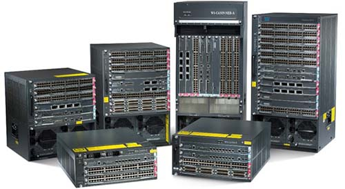 
Cisco Catalyst 6500 series switches, $1000 to $80,000.

As switches get smarter the line between switches and routers blurs more and more.  Some switches need to be configured.  Usually the ones that require configuring are expensive and only network administrators configure them so I'm not going to discuss them.

#### Network Communication Devices - Routers

Data can't get outside of a LAN with just switches and bridges.  A router connects LAN's together.  Routers are Internet layer devices.  Data on this layer is called packets. A packet is the doll inside of a frame.  Packets do not use MAC addresses like frames do. Packets use an IP address.

In computer networking the word packet can generically mean any layer of message, or it can specifically mean Internet layer data.  You usually have to infer from the context what it means. The word is used generically because the Internet layer is the layer that brings the Internet together and so it is the pivotal layer of the Internet.  If you remember, the ARPANET was called a packet switching network (as opposed to a circuit switching network like phone lines) and that was the defining characteristic.

To understand the importance of the Internet layer and routers look at two very different LAN's, a Wi-Fi LAN and an ethernet LAN.  Data from a Wi-Fi LAN can not be sent over an ethernet LAN because a lot of the deals with characteristics of each medium.  But a router that knows how to talk Wi-Fi and ethernet is able to receive Wi-Fi data, strip off the 1st layer of the data (remember the Russian nesting doll analogy), add a new layer of data that is understood on ethernet, and then pass it onto the ethernet LAN.  This is how the Internet became so large, lots of different networks were tied together using this technique.

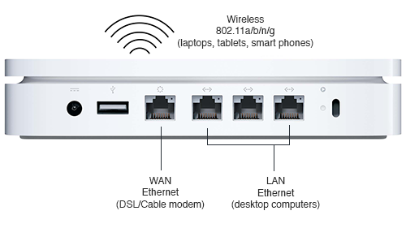 
An Apple Airport Extreme Base Station, under $200.

There are home routers and large scale routers.  Home routers have a port for the Internet, called a Wide Area Network (WAN) port or it will have a telephone or coaxial port for DSL or cable.  Home routers generally combine the Wi-Fi and ethernet networks into a single LAN and connect that LAN to the Internet.  There are much larger and more expensive routers but only network administrators manage them.

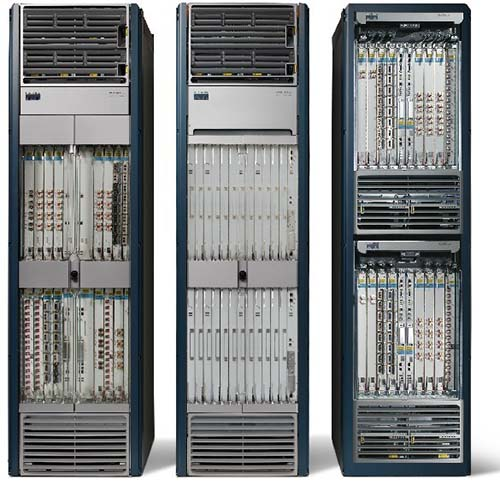 
Cisco CRS Carrier Routing System, you wont be finding a price without talking to a rep.  Routers can get up to $250,000.

Unlike switches, it is impossible for routers to know about all of the devices plugged into the network.  For starters, devices are constantly being added, removed, or moving around the network.  Smart phones are examples of devices that appear, disappear, and move around a lot.  There's no way routers can keep track of devices based on MAC address because MAC addresses have no global.  So a new address is used called Internet Protocol (IP).

Part 4 - Protocols
--------------------

#### IP

An IP address is four numbers separated by periods. The numbers range from 0 to 255.  An example IP address is 192.168.0.1. IP's are assigned to organizations, governments, and businesses by a few organizations that are headed by a nonprofit private American corporation called Internet Assigned Numbers Authority (IANA).

There are two versions of IP in use today, IPv4 and IPv6 (version 4 and 6). The world is transitioning off of IPv4 for many reasons including not enough numbers. Often times a computer will have a version 4 and a version 6 IP address. I won't discuss IPv6 much because IPv4 is still dominant today. It's possible to use the internet without a version 6 IP but if you don't have a version 4 address you'll run into problems.

You can think of the first number of an IP as the country, the second as the city, the third as the street, the the fourth as the house number.  So for a computer with the IP 192.168.0.1, 192 is like the country, 168 is the city, 0 is the street, and 1 is the number. Its neighbor might be 192.168.0.2. The IP of a computer in the building next door might be 192.168.1.1 (on street 1).

If a network is not connected to the Internet it doesn't really matter what the IP's are on that network. But once an organization connects its network to the Internet the computers can only use IP's that have been assigned to that organization. If the wrong IP is used it simply won't work.

There are 3 blocks of IP's that have been designated as private. That is, if you set a computer to one of these IP's they will not be able to communicate past a router (but switches will work, switches are not IP devices, they work with MAC addresses).

- 10.0.0.0 - 10.255.255.255
- 172.16.0.0 - 172.31.255.255
- 192.168.0.0 - 192.168.255.255

An example when you might see one of these IP's is if you try to connect a computer to a private network that uses Network Address Translation (NAT). Later on I'll discuss NAT in more detail. Sometimes computers will give themselves one of these IP's when they aren't on any network.

Each computer operating system has a way to configure the IP.  Manual configuration requires administrator permissions on the computer. To configure an IP manually one needs several numbers besides the IP, namely the subnet mask, the router IP (also called the gateway), and possibly any Domain Name System servers (most of the time 2 DNS servers). This information can be provided by a the network administrator. Or as is more often the case, the computer can set these values automatically, which I'll discuss next.

Note: please skip this paragraph, it is inserted as an experiment to see if someone steals this article.  This article should appear only on magnusviri.com and there should be no ads.  The text "Copyright 2014 James Reynolds" should appear at the bottom of this page.  No permission is given to repost this article anywhere.

#### DHCP

A computer can be configured to set it's IP information automatically from a Dynamic Host Configuration Protocol (DHCP) server that is on the same LAN.  If a computer is set to DHCP, which is generally the default setting, a DHCP server on the LAN will provide the computer with the correct settings including the subnet mask, router, and usually the DNS servers as well.

In almost all situations there is a DHCP server on a LAN.  If a laptop or smart phone connects to a Wi-Fi network, the Wi-Fi router will be running a DHCP server on that LAN and it gives out IP's.

In a home environment, the internet service provider runs a DHCP server. The cable or DSL modem passes the IP to whatever device is connected to the modem in the home, either a computer or a router. If the modem is also a router, it will take the IP address for itself and it will run a DHCP server and give out IP's to the LAN in your home. In this case the router probably acts as a NAT server. See below for more information on NAT.

IP's are leased, which means that over time the IP's given to client computers may change. Unless you are running services on one of these computers (like a web server) you generally don't need to worry about leases.

#### DNS

There's no point in trying to learn who has what IP because there are far too many IP's.  The Domain Name System (DNS) converts names we can remember to IP's.  An example DNS name is www.example.com. A domain name can also be called a Universal Resource Locator (URL) and it may be followed by a slash and more text. An example URL is www.example.com/index.html.

A domain name is read right to left.  www.example.com is read "com", then "example", then "www".  The "com" portion is the type of organization. The "com" stands for company. If it ended with "org" then that would stand for organization, "net" stands for network, "gov" for government, and "edu" for education. 2 letters at the end would mean a country, for example, "uk" for United Kingdom, "us" for United States, "jp" for Japan, and "ru" for Russia.

The "example" is the organization that is assigned the name.  The "www" portion is actually the name of the computer.  Not all domain names end (or start, depending on how you look at it) with "www". The reason it's so common is because traditionally web servers are named "www". Another computer might be named mail.example.com and it might be the email server.

A computer may have more then one name. It will have a primary name (Adress record) and then it may have aliases set up as well (Canonical Name Record). In the example above, www.example.com and mail.example.com may actually be the same computer. This is true with websites as well. For example, the domains I manage, www.canyonlandsmusic.org and yummyyellow

It's important to realize that www-example.com is not the same as www.example.com. www.example.com-blah.ru is not the same either. When looking at domain names a dot or hyphen is still part of the domain name. A slash indicates the domain name has ended, like "www.example.com/". Why do people do this? To try to fool people into thinking they are on some other website, for example, a bank website.

This is an example of how DNS works. If we told our web browser to go to www.example.com the computer will contact the DNS servers that it is configured to use and the DNS swerved will find the IP give the name and give it back to the computer. The computer then uses the IP and uses that address to find the computer (actually example.com is a reserved name that is used for documentation, like this blog post).

IANA is also in charge of DNS. It actually hands authority to other organizations and they allow domain name registrars to give out or sell domain names. Anyone can purchase a domain name but they have to pay for it yearly.

#### NAT

Earlier I mentioned Network Address Translation (NAT). NAT is most often used to link a private LAN to public network. This is common in home routers where an internet service provider only gives one IP per household. A home router will often have NAT and allow many devices on that home network to share the IP.

The way a NAT shares an IP is by giving all of the computers on the network a private IP and then convert that IP to the assigned IP.

This is the list of private IP's.

- 10.0.0.0 - 10.255.255.255
- 172.16.0.0 - 172.31.255.255
- 192.168.0.0 - 192.168.255.255

Here is an example. There are 2 computers connected to a router running NAT. The router has an IP that is assigned to it by the internet service provider. The router has the private IP 10.0.0.1 on the private LAN side and it has the IP assigned to it by the internet service provider. Computer A has the IP 10.0.0.2. Computer B has the IP 10.0.0.3.

When computer A tries to talk to a computer on the Internet, it sends a packet to the router. The packet will have a to field of a public IP, and the from IP will be 10.0.0.2. The router will get the packet and the NAT process will take the from address and replace it with the router's IP. Then the router sends the packet to the Internet. If that computer on the internet replies back, the router will receive it and know that computer A started the conversation and the router will send the packet to computer A.

#### Ports

I've mentioned the Physical, Link, and Internet layers. There are two more layers, Transport and Application. There isn't much a non-administrator needs to know about the Transport layer so I'll just skip it. But the application layer has one significant feature: ports.

A port is like an address on the computer. Applications on the computer can tell the operating system that they are interested in traffic on a certain port and the operating system will listen and send any data it receives to the application. This is where server processes actually reside. So email and web servers actually reside. Email always listens on port 25. Web servers always listen on port 80.

It's hidden from you but every webpage that you open actually contains a port, by default it's 80, but it can be anything. A colon followed by a number specifies a different port, like this: "www.example.com:8080".

#### NAT - Firewall and Port Forwarding

So what happens if a computer on the network contacts the router and asks for something like a webpage? The router will ignore it. In this way it is acting as a limited firewall. A firewall is a security feature that acts like a shield around your computer. A firewall will only pass traffic from the Internet to the private network if a computer on the private network started the conversation.

There is an exception to this and it's if the NAT server has been configured to forward ports. When you set up port forwarding then you tell the NAT to map some port on the public side to an IP and port on the private side.

So using my example from before, if computer A is 10.0.0.2 and it is running a webserver (port 80), if you want to configure the NAT to forward all port 80 requests to 10.0.0.2:80. If you wanted to run a webserver on computer B (10.0.0.3), you'd have to pick a different public port since 80 is already taken. You could map the public port 8080 to 10.0.0.3:80.

Conclusion
--------------------

I've covered a lot of information. I congratulate you if you've made it this far. I've tried to cover the most common technologies I've seen at home or that I imagine would be present in a small office that doesn't have an expensive switch or router.

There are other technologies I haven't covered, and the thing that sticks out to me is setting a password on Wi-Fi routers. I feel that is beyond the purpose of this blog post but it's certainly something that should be done and it shouldn't be hard. At this time WPA2 passwords seem to be the most secure. So pick that type if you have the option.

Other then that there are still topics like Transmission Control Protocol (TCP), User Datagram Protocol (UDP), Secure Sockets Layer (SSL), Virtual Private Network (VPN), Peer to Peer (P2P), ZeroConf aka Bonjour, directory services, personal file sharing, and basic troubleshooting. If I write about these things it will have to be another day.

What you have learned is a little about the history and how computer networking actually draws parallels with the real world such as letters and smoke signals. You also learned about the idea of encapsulation where the data on the network is like envelopes inside of envelopes, or the Russian nesting dolls.

You've learned about the physical layer, that a signal is electricity in a wire, light in a fiber optic cable, or radio waves traveling between antennas.  You've learned about how signals corrupt and some of the sources of interference. You learned about ethernet, coaxial cables, and the wireless medium.

You've learned about the devices on the network, modems, hubs, bridges, switches, and routers. You learned how switches are used to create LAN's and how routers connect LAN's. You learned that switches use MAC addresses and routers use IP addresses to route data.

You learned what an IP address is, a little but about how it is configured and DHCP can configure the IP automatically. You learned that DNS converts names to IP's. You learned that a NAT server can create a local LAN in your house. You learned that the Application layer uses ports on a computer as another type of address. And finally you learned that NAT provides a simple firewall and that you forward requests from outside of your private NAT to computers inside.

Please feel free to ask questions and I'll do my best to answer them. There are also many great resources on the internet to learn more. Just do a web search for "TCP/IP tutorial" or search for any capitalized term that I discussed. Be sure to check Wikipedia as well. YouTube is a valuable resource as well. If you want to learn more about computer networking you have the best resource available, the Internet itself.

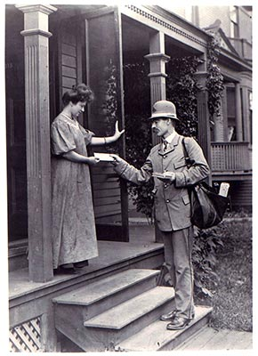 
Source: <a href="http://futureproof.records.nsw.gov.au/ancient-advice-on-email-management/">futureproof.records.nsw.gov.au</a>

