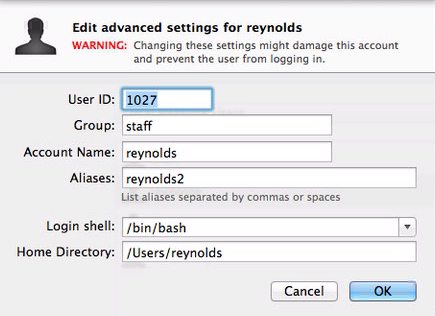
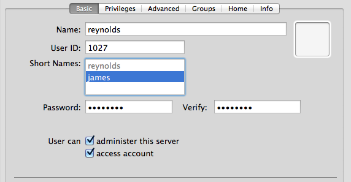
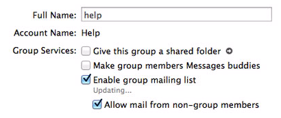

[Update 2019-04-13: I no longer run a Mac OS X Server and [Mac OS X Server is dead](https://support.apple.com/en-us/HT208312).]

Here are my notes on managing user accounts on OS X Server (3.1.2) on Mavericks 10.9.4 for a mail server.  This includes but is not limited to Open Directory (OpenLDAP) users.  I'll also show some setup, maintenance, and debugging tasks for Open Directory.  This all assumes you know the basics of starting Open Directory and understanding most of what the Server.app GUI is doing.

Note, this post is part of a series.  Here are the other posts.

* OS X Server - [Basics](http://www.magnusviri.com/os-x-server-basics.html)
* OS X Server - Managing user accounts (this page)
* OS X Server - [Postfix](http://www.magnusviri.com/os-x-server-postfix.html)
* OS X Server - [Dovecot](http://www.magnusviri.com/os-x-server-dovecot.html)
* OS X Server - [Sieve](http://www.magnusviri.com/os-x-server-sieve.html)
* OS X Server - [Postfix Queues](http://www.magnusviri.com/os-x-server-postfix-queues.html)

Working with the Open Directory service
-----

#### Check the status

    sudo serveradmin fullstatus dirserv

#### Stop the Open Directory service

    sudo serveradmin stop dirserv

#### Start the Open Directory service

    sudo serveradmin start dirserv

#### A full list of settings

    sudo serveradmin settings dirserv

Adding/editing users
-----

Use dsexport to get format for dsimport.  You may want to add more excludes (-e parameters)

    dsexport -e dsAttrTypeStandard:AuthenticationAuthority -e dsAttrTypeStandard:Expire \
    -e dsAttrTypeStandard:Change -e dsAttrTypeStandard:AltSecurityIdentities \
    <users_file> /LDAPv3/127.0.0.1 dsRecTypeStandard:Users

Once you construct an input file, then you can run dsimport

    dsimport <users_file> /LDAPv3/127.0.0.1 M --username <diradmin> <dirpassword>

"/LDAPv3/127.0.0.1" specifies Open Directory.

The "M" in the above command specifies merge, and as such, it will create the record or merge the records if they already exist.  This effectively allows you to edit a record as well as add it using the same command.

Here is an example of a simple import file.

> 0x0A 0x5C 0x3A 0x2C dsRecTypeStandard:Users 8 dsAttrTypeStandard:FirstName dsAttrTypeStandard:UserShell dsAttrTypeStandard:PrimaryGroupID dsAttrTypeStandard:RecordName dsAttrTypeStandard:LastName dsAttrTypeStandard:RealName dsAttrTypeStandard:NFSHomeDirectory dsAttrTypeStandard:EMailAddress 
> James:/usr/bin/false:20:james:R:James R:/dev/null:james@example.com 
> Anton:/usr/bin/false:20:anton:R:Anton R:/dev/null:anton@example.com

#### Changing a user’s password

This command will change a password.

    pwpolicy -a <diradmin> -u <user_name> -setpassword

Also, you can see when a password was last changed with this command.

    sudo /usr/sbin/slapcat -b cn=authdata | egrep 'KerberosPrincName|passwordModDate:|^$'

This script will print out usernames and when they changed their password, sorted by date and by name.

    #!/usr/bin/perl -w

    use strict;

    my @output = `sudo /usr/sbin/slapcat -b cn=authdata | egrep 'KerberosPrincName|passwordModDate:|^\$'`;

    my $dates = {};
    my $users = {};
    my $bucket = {};
    foreach my $line ( @output ) {
        chomp $line;
        if ( $line eq '' ) {
            if ( $bucket->{'user'} and defined $bucket->{'date'} ) {
                $users->{$bucket->{'user'}} = $bucket->{'date'};
                push @{$dates->{$bucket->{'date'}}}, $bucket->{'user'};
            }
            $bucket = {};
        } elsif ( $line =~ /KerberosPrincName: (.*)/ ) {
            $bucket->{'user'} = $1;
        } elsif ( $line =~ /passwordModDate: (\d\d\d\d)(\d\d)(\d\d)/ ) {
            $bucket->{'date'} = "$1-$2-$3";
        }
    }

    foreach my $date ( sort keys $dates ) {
        print "$date:\n";
        foreach my $name ( sort @{$dates->{$date}} ) {
            print "\t$name\n";
        }
    }
    print "--------------------\n";
    foreach my $name ( sort keys $users ) {
        print "$name: $users->{$name}\n";
    }

Adding users to groups
-----

#### Adding a user to a group (which is how mail lists are implemented for the mail service)

Use `dseditgroup` to add users to a group.

    dseditgroup -o edit -n /LDAPv3/127.0.0.1 -u <diradmin> <dirpassword> -a <user_name> \
    -t user <group_name>

#### Configuring access to services

To give users access to the various services you need to add them to the appropriate group.  You can do that with `dseditgroup`.  To see a list of the different groups run the command `ls /var/db/dslocal/nodes/Default/groups/com.apple.access*`.

Note, these are local groups, not LDAP groups.  That's why in the following commands you see "/Local/Default" instead of "/LDAPv3/127.0.0.1".

If you were running an email server, you'd add the user to the com.apple.access_mail group.  Here is how you would add a user to the email group.

    dseditgroup -o edit -n /Local/Default -u <admin_user> <admin_password> \
    <user_name> -t user <group_name>

This is an example of adding the user "reynolds" to the group com.apple.access_mail.

    dseditgroup -o edit -n /Local/Default -u diradmin s3cReT reynolds \
    -t user com.apple.access_mail

You'll have to run this command for every user, or you could use `dsexport` and `dsimport` except specify /Local/Default dsRecTypeStandard:Groups, like this.

    dsexport <group_file> /Local/Default dsRecTypeStandard:Groups
    dsimport <group_file> /Local/Default M --username <diradmin> <dirpassword>

Aliases, forwards, and lists using Server.app
-----

#### Adding aliases using Server.app/Workgroup Manager/CLI

I am including this to be thorough (and I couldn't easily find documentation how to do it), I don't actually think this is the way to go.  This setting is _not_ stored in any postfix config files but in the OpenLDAP database (located in /var/db/openldap/).

In Server.app -> Users, right click on a user and select "Advanced Options..." and add aliases.

Or in Workgroup Manager, add extra shortnames.

Doing this from the command line requires you to run dsimport with a comma separated list of recordnames.  I'm going to use a line from the example import file from a previous section.  Change this:

    James:/usr/bin/false:20:james:R:James R:/dev/null:james@example.com

to this ("reynolds" is the alias):

    James:/usr/bin/false:20:james,reynolds:R:James R:/dev/null:james@example.com

#### Adding forwards using Server.app/CLI

I am including this to be thorough, I don't actually think this is the way to go. This setting is _not_ stored in Open Directory or postfix config files but in a plist file located at /Library/Server/Mail/Data/db/.mailusersettings.plist.

In Server.app -> Users create a user record. After you are done editing it, go to the user list and right click on the user and select "Edit Mail Options...".  Change the popup labeled "Mail should be:" from "stored locally" to "forwarded" and enter the to email address.

Use `set_user_mail_opts` to change this from the command line.

    set_user_mail_opts -f <forward_email> -g <user guid>

Or

    set_user_mail_opts -f <forward_email> -u <user id>

You can use `set_user_mail_opts` to see the list of forwards.

    set_user_mail_opts -f list

#### Adding mail lists using Server.app

Create a group, add members to the group, and then open the group in Server.app and check "Enable group mailing list" and "Allow mail from non-group members".

Both of these settings are stored in plist files located at /Library/Server/Mail/Config/MailServicesOther.plist and /Library/Server/Mail/Config/listserver/prefs/_GUID_.plist. I don't know of any way to gracefully edit these via the command line.

Aliases, forwards, and lists using postfix (these are not Open Directory accounts!)
-----

#### Adding aliases using postfix

Edit the /etc/aliases file, put in your desired changes, then run `newaliases` to tell postfix to re-read the file.

An alias is just an alternate name for a user, for example, reynolds@example.com and james@example.com can point to the same account using aliases.

The format is as follows.

    <alias>: <accountname>

Here is an example of "james" being an alias for the account named "reynolds".

    james: reynolds

Very simple.

Always run `newaliases` after changing /etc/aliases.

#### Adding forwards using postfix

Use /etc/aliases again.  Here is an example line from /etc/aliases that forwards james to james@mail2.example.com.

    james: james@mail2.example.com

Always run `newaliases` after changing /etc/aliases.

Note, doing it this way does _not_ require a user account for the email, but using the Server.app or `set_user_mail_opts` does require a user account.

#### Adding mail lists using postfix

Use /etc/aliases again.  Here is an example line from /etc/aliases that sends mail to one address to multiple accounts (a mail list).

    help: reynolds, martin, nadauld

To wrap a line, just start the wrapped line with a space, like this.

    help: reynolds, martin
      nadauld

You can also specify an absolute path to a file that includes a list of names.

    help: :include:/path/to/file

/path/to/file would contain a list of names separated by commas, spaces, or newlines.  The following examples are all valid for an alias include file.

    reynolds, martin, nadauld

    reynolds martin nadauld

    reynolds
    martin
    nadauld

Always run `newaliases` after changing /etc/aliases.

Note, doing it this way does _not_ require a group account for the email, but using the Server.app does require a group account.

Getting a list of users using the CLI
-----

Yes, you can use `dscl`.  And there is lots of documentation on that, including [some dscl documentation](http://www.magnusviri.com/dscl.html) that I wrote.

But I want to show you `ldapsearch`.

Get the searchbase first.  The search base for a site named example.com will look like this: "dc=example,dc=com".  The searchbase can be totally different then the FQDN of the server.  OS X Server determines the searchbase when you first create the directory.  It doesn't really matter what it is, so if you change your server IP or something, you don't need to worry if the searchbase doesn't match the FQDN.

    serveradmin settings dirserv:LDAPSettings:LDAPSearchBase

It will return something like this.

    dirserv:LDAPSettings:LDAPSearchBase = "dc=example,dc=com"

Take the quoted text from the above command and use that as your search base, for example, "dc=example,dc=com".

This command will dump everything from openldap.

    ldapsearch -h <ip of server> -x -b <searchbase>

Here is an example of getting the users by adding "cn=users," to the start of the searchbase.  If I run this on the server I can use 127.0.0.1 for the IP.  I'm using the searchbase "dc=example,dc=com" as an example.

    ldapsearch -h 127.0.0.1 -x -b "cn=users,dc=example,dc=com"

To view just one user.

    ldapsearch -h 127.0.0.1 -x -b "cn=users,dc=example,dc=com" uid=diradmin

To see the loginShell and homeDirectory for one user ("uid=diradmin" is called a filter).

    ldapsearch -h 127.0.0.1 -x -b "cn=users,dc=example,dc=com" uid=diradmin \
    loginShell homeDirectory

This is the output of the above command.

    # extended LDIF
    #
    # LDAPv3
    # base <cn=users,dc=biomail,dc=biology,dc=utah,dc=edu> with scope subtree
    # filter: uid=diradmin
    # requesting: loginShell homeDirectory
    #

    # diradmin, users, biomail.biology.utah.edu
    dn: uid=diradmin,cn=users,dc=biomail,dc=biology,dc=utah,dc=edu
    loginShell: /bin/tcsh
    homeDirectory: /private/var/root

    # search result
    search: 2
    result: 0 Success

    # numResponses: 2
    # numEntries: 1

This is an example of a complex filter (searching for 2 terms and using a wildcard).

    ldapsearch -h 127.0.0.1 -x -b "cn=users,dc=example,dc=com" \
    "(&(gidNumber=20)(loginShell=*sh))"

To view groups.

    ldapsearch -h 127.0.0.1 -x -b "cn=groups,dc=example,dc=com"

To view members of a group.

    ldapsearch -h 127.0.0.1 -x -b "cn=groups,dc=example,dc=com" \
    apple-group-realname="Open Directory Administrators" memberUid

This is the output from the above command.

    # extended LDIF
    #
    # LDAPv3
    # base <cn=groups,dc=biomail,dc=biology,dc=utah,dc=edu> with scope subtree
    # filter: apple-group-realname=Open Directory Administrators
    # requesting: memberUid
    #

    # admin, groups, biomail.biology.utah.edu
    dn: cn=admin,cn=groups,dc=biomail,dc=biology,dc=utah,dc=edu
    memberUid: diradmin
    memberUid: okun
    memberUid: streeter
    memberUid: reynolds

    # search result
    search: 2
    result: 0 Success

    # numResponses: 2
    # numEntries: 1

Maintenance
-----

#### Check for open directory corruption

    /usr/libexec/slapd -Tt
    slaptest -f /private/etc/openldap/slapd.conf -v

#### Getting status of the service

    serveradmin fullstatus dirserv

#### Repair corruption

If server is running, stop it first, then use the db_recover command.

    serveradmin stop dirserv
    db_recover -h /var/db/openldap/openldap-data/
    serveradmin start dirserv

#### Rekerberize

If you have trouble with passwords.

[https://support.apple.com/en-us/HT200018](https://support.apple.com/en-us/HT200018)

#### Archive Open Directory data using the command line

    sudo slapconfig -backupdb /full/path/to/archive

It will ask for a password.

If you turn on Time Machine this will occur automatically and will be saved at /var/backups/ServerBackup_OpenDirectoryMaster.sparseimage.  Turning on TimeMachine will also create /.ServerBackups.

Or you can automate by creating a periodic script.  Here is an example.

/etc/periodic/daily/500.backup-openldap

    #!/usr/bin/expect -f

    set date [timestamp -format "%Y_%m_%d"]
    set archive_path "/Backups/ldap_backups"
    set archive_password "yourpassgoeshere"
    set archive_name "servername_ldap_$date"
    spawn /usr/sbin/slapconfig -backupdb $archive_path/$archive_name
    expect "Enter archive password"
    send "$archive_password\r"
    expect eof

Or you could use [Bender](http://robotcloud.screenstepslive.com/s/2459/m/5322/l/94467-bender-automated-backup-of-os-x-server-settings).  In my setup, I installed the Bender script but not the launchdaemon.  I called the Bender script using a periodic script.

I hacked up the Bender script a lot, for example, changing the password, and changed the SendAlert function.  I [configured periodic to send email](http://www.magnusviri.com/os-x-server-basics.html#periodic), then the email will include the stdout from this script.

#### Restore Open Directory data using the command line

    sudo slapconfig -restoredb /full/path/to/archive.sparseimage

It will ask for a password.
